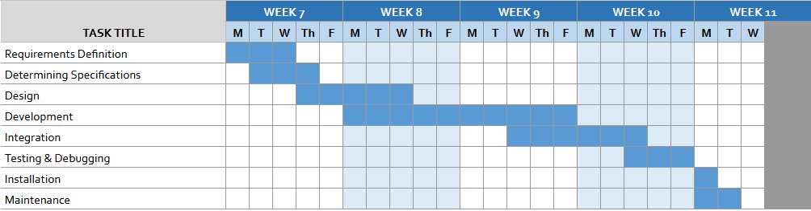
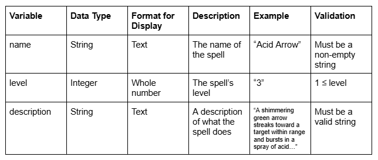
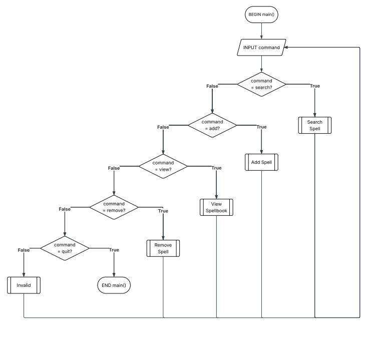
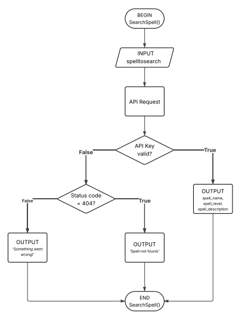

# **11SE TASK 1 2025 - SPELLBOOK APPLICATION**

# GANTT CHART

# STRUCTURE CHART

# DATA DICTIONARY

# ALGORITHMS

    BEGIN main
    INPUT command
    IF command = "search" THEN
        SearchSpell()
    ELSE IF command = "add" THEN
        AddSpell()
    ELSE IF command = "view" THEN
        ViewSpellbook()
    ELSE IF command = "view" THEN
        RemoveSpell()
    ELSE IF command = "quit" THEN
        QUIT
    ELSE
        Invalid()

    BEGIN SearchSpell()
    INPUT spelltosearch
    APIRequest()
    IF api_key is valid THEN
        DISPLAY spell_name, spell_level, spell_description
    ELSE IF status_code = 404 THEN
        DISPLAY "Spell not found."
    ELSE
        DISPLAY "Something went wrong!"
    END SearchSpell()

    BEGIN RemoveSpell()
    IF spellbook is not empty THEN
        INPUT spelltoremove
        IF spelltoremove in spellbook THEN
            REMOVE spelltoremove from spellbook
            DISPLAY "Spell removed."
        ELSE
            DISPLAY "Spell not found."
    ELSE
        DISPLAY "No spells to remove!"
    END RemoveSpell()